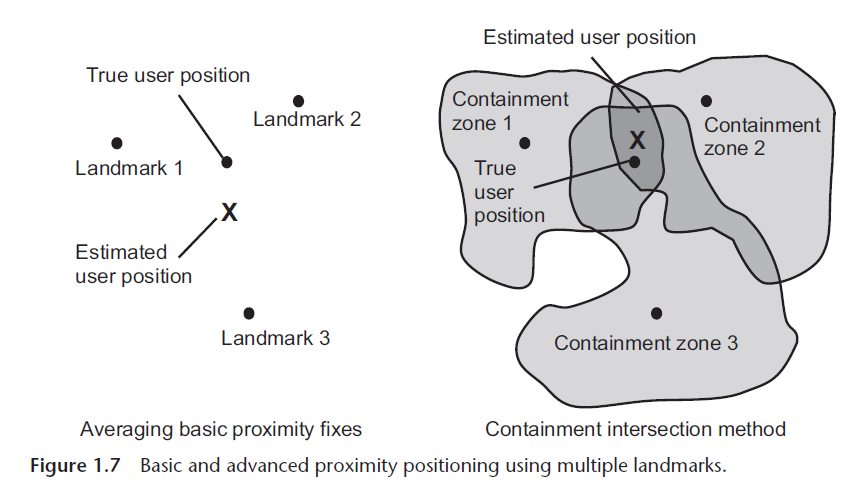
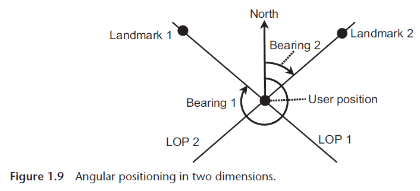
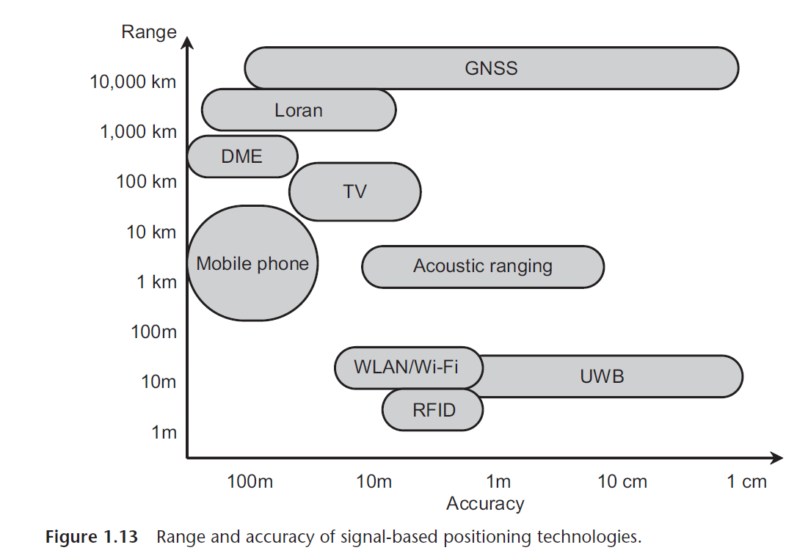

## Introduction

Notes from the chapter Introduction of the book "Principles of GNSS, Inertial, and Multisensor Integrated Navigation Systems" - Paul D. Groves

### 1.1 Fundamental Concepts

**Navigation** involves two main concepts: determining the position and velocity of a moving body relative to a reference point, and planning a course to move from one place to another while avoiding obstacles. **Positioning** is the determination of the position of a body and is thus a subset of navigation.

Positioning techniques can be categorized into:

1. **Real-time vs. Postprocessed**: Real-time positioning calculates positions immediately, while postprocessed techniques do so later. Real-time positioning is further divided into continuous (for navigation) and instantaneous (for single-point applications).

2. **Fixed vs. Movable Objects**: Positioning for fixed objects is static, while for movable objects (like in navigation), it is dynamic. Navigation requires velocity, which may be derived from updated positions or other methods.

3. **Self-positioning vs. Remote Positioning**: Most navigation applications use self-positioning, where the object calculates its position. Remote positioning involves calculating the position elsewhere without the object’s cooperation.

A **navigation system** is a device that determines position and velocity automatically. Similarly, a positioning system determines position. An integrated navigation system determines position and velocity using more than one technology.

**Navigation sensors** like accelerometers and gyroscopes measure properties to compute outputs, and the **navigation solution** provides position, velocity, and sometimes additional data like heading or acceleration. Depending on the application, this can be 2D (for cars, trains, etc.) or 3D (for air, space, underwater, or indoor navigation).

The **user** in navigation refers to the person or software that receives the position and velocity solution, and **user equipment** refers to the system located on the object being positioned.

**Position** is expressed quantitatively (e.g., coordinates), while **location** is expressed qualitatively (e.g., city, street). A map or GIS system can convert between the two.

Some authors use the term **localization** instead of positioning, particularly for short-range applications.

Positioning and navigation techniques rely on two fundamental methods:

- **Position Fixing**: Uses external information like signals (radio, acoustic, ultrasound, optical, or infrared) or environmental features (e.g., landmarks, terrain, signs, roads, rivers, terrain height, sounds, smells, and even variations in the magnetic and gravitational fields) to determine position. A navigation aid (AtoN) is a landmark used specifically for navigation.

- **Dead Reckoning**: Measures distance and direction traveled using a self-contained system, like an INS, without relying on external infrastructure. Environmental features can also assist dead reckoning by comparing repeated measurements.

### 1.2 Dead reckoning

Dead reckoning, possibly derived from "deduced reckoning," involves calculating the current position by measuring changes in position or velocity and integrating this data. This information is added to a previous position to determine the current one. Measurements are taken in body-aligned axes, requiring an attitude solution to establish the travel direction relative to the environment.

- 2D Navigation: A heading measurement suffices.
- 3D Navigation: Requires a full three-component attitude measurement.
- Accuracy: Smaller step sizes in calculations improve accuracy, especially when attitudes change.

Modern methods include automated pace counting with pedometers and advanced pedestrian dead reckoning (PDR) using accelerometers to estimate step length.

An odometer measures distance via wheel rotations and is standard in vehicles, dating back to Roman times. Marine equivalents include electromagnetic speed logs or sonar, while aircraft use Doppler radar. Environmental feature tracking (e.g., camera or radar images) is also employed.

Heading Measurement:

- Magnetic compasses (ancient but now with electronic readouts) are common.
- Marine heading: Determined with gyrocompasses.
- Land heading: Derived from vehicle trajectory.
- Roll and pitch: Measured using accelerometers, tilt sensors, or celestial observations (sun, moon, stars).
- Gyroscopes and differential odometry help measure changes in attitude and heading.

Inertial Navigation Systems (INS):

- A complete 3D dead-reckoning system includes inertial sensors (IMU: accelerometers and gyroscopes) and a navigation processor.
- Accelerometers measure specific force, and gyroscopes maintain the attitude solution. The processor integrates these to compute position, velocity, and attitude.

Performance:

- Navigation accuracy depends on sensor quality
- The principal advantages of inertial navigation and other dead-reckoning techniques, compared to position fixing, are continuous operation, a high update rate, low short-term noise, and the provision of attitude, angular rate, and acceleration as well as position and velocity.
- The main drawbacks are that the position solution must be initialized and the position error grows with time because the errors in successive distance and direction measurements accumulate.
- In an integrated navigation system, position-fixing measurements may be used to correct the dead-reckoning navigation solution and also calibrate the dead-reckoning sensor errors.

### 1.3 Position Fixing

#### 1.3.1 Position-Fixing Methods

There are five main methods: proximity, ranging, angular positioning, pattern matching, and Doppler positioning.

- **Proximity**:  
  Simplest method, assumes the receiver's position is the transmitter's or a nearby feature's. Accuracy improves with proximity to landmarks. Short-range signals like Bluetooth, RFID, or indoor features are ideal. Using multiple landmarks allows averaging of their positions.  
  **Containment** Intersection: A refined proximity method where containment zones around landmarks are defined. Observed landmarks localize the position to the intersection of these zones, with the center of the intersection as the position fix.  
  { width="500" }
- **Ranging**:  
  Measures distances to landmarks and defines circular lines of position (LOPs) based on these ranges. The user's position lies at the intersection of LOPs. At least two LOPs are needed; three resolve ambiguities. (Or prior information)  
  In three-dimensional positioning, each range measurement defines a spherical surface of position (SOP) centered at a landmark. The intersection of:
  - Two SOPs forms a circular line of position (LOP).
  - Three SOPs intersects at two points, requiring additional information or a fourth SOP to determine a unique position fix.

  If the user and landmarks are coplanar, only planar position components can be determined, limiting vertical accuracy in terrestrial systems.  
  Range Measurement: based on signal time of flight (TOF), multiplied by the speed of light or sound. Accurate TOF measurement depends on transmitter-receiver time synchronization.
  - Two-way ranging (e.g., distance measuring equipment - DME) minimizes synchronization errors via bidirectional signal exchange.
  - One-way ranging (e.g., GNSS) requires synchronized transmitter clocks, treating receiver clock offset as an unknown. This technique is known as passive ranging and is how GNSS works. Additional transmitters or reference receivers can correct for clock offsets.
  - Where the landmark is an environmental feature, active sensors like radar, sonar, or laser transmit signals to a landmark, measure the reflected signal's round-trip time, and calculate the range.

  { width="500" }
- **Bearing**:  
  A bearing is the angle in the horizontal plane between the line of sight to an object and a reference direction (e.g., true or magnetic north).  
  Position Fixing with Bearings:
  - Two-Dimensional Positioning: Measuring the bearing to two known landmarks defines straight LOPs. Their intersection gives the user’s position. Without a reference direction, measuring the angle difference between two landmarks defines a curved LOP, requiring three landmarks for positioning.
  - Three-Dimensional Positioning: Extends by measuring the elevation angle (line of sight vs. horizontal plane) to one landmark. However, accuracy decreases with distance, and Earth's curvature affects measurements.

  { width="400" }
- **Angle of Arrival (AOA)**:  
  Direction Finding: Uses steerable directional antennas to determine signal bearing.
  - Nonisotropic Transmissions: Broadcast signals with modulation varying by direction enable bearing and/or elevation determination. Examples include VHF omnidirectional radiorange (VOR) and Nokia HAIP (high-accuracy indoor positioning).
  - Environmental features can be measured using cameras, laser scanners, imaging radar, or multibeam sonar. The position of a feature in the sensor's image, combined with sensor orientation, determines its bearing and elevation.
- **Integrated Navigation System**:  
  Full position fixes are unnecessary; single measurements (e.g., range, bearing, or elevation of a landmark) can contribute to the navigation solution. For example, a two-dimensional position fix may be obtained by measuring the range and bearing of a single landmark as shown in Figure 1.10. Adding elevation provides a three-dimensional fix.
- Landmark Identification:  
  Signals are identified via demodulation, transmitter IDs, or frequency. Environmental features are matched with stored data, requiring distinctive features and approximate position inputs to limit the size of database that must be searched to obtain a match. Even so, positioning using environmental features is normally more processor intensive than signal-based positioning.
- **Pattern Matching**:  
  A database contains parameters varying by location (e.g., terrain height, signal strength, magnetic fields, GNSS obstructions).
  Measured values at the user’s position are compared with database values at candidate grid points. The best match determines the position.
  Interpolation refines results if several candidates match well. As with feature matching for landmark identification, the input of
  an approximate position solution limits the size of the database to be searched.  
  Combining multiple parameters into a **location signature** enhances uniqueness and accuracy.
  In some cases, such as terrain height, there is insufficient information to obtain an unambiguous position fix. However, if the navigation system is moving, measurements may be made at multiple positions,
  collectively known as a transect. Position fixing can be enhanced by this. Using dead reckoning to relate transect points allows measurements to form a location signature, compared with a database for positioning, requiring interpolation if spacing differs.
- **Doppler Positioning**:  
  Measures Doppler shift from relative transmitter-receiver motion to determine relative velocity and a conical surface of position (e.g., used in Iridium positioning).
- **Height Measurement**:  
  Barometric Altimeter: Uses pressure to estimate height or underwater depth.
  Radar Altimeter: Measures height above terrain for aircraft where terrain height is known.
- **Data and Databases**:  
  Position-fixing methods rely on data like landmark positions, feature info, and pattern-matching parameters. Databases may be preloaded but require updates and significant storage for large areas.
- **SLAM (simultaneous localization and mapping)**:  
  Allows systems to create and update its own landmark databases by exploring environments, observing features several times and and using dead reckoning to track traveled distances.
  
Many signal-based positioning systems include transmitter positions in their signals, but this can delay position computation after signal reception. A separate data link, known as assistance, can provide the necessary information on demand to reduce delays.
  
Position fixing is essential for determining absolute position, with errors independent of the distance traveled, but it depends on the availability of suitable signals or environmental features. To enhance position accuracy and availability, multiple position-fixing technologies or dead reckoning can be combined to bridge gaps.

#### 1.3.2 Signal-Based Positioning

Early Radio Navigation: Radio-based navigation started in the 1920s, with systems like Omega providing global coverage in the 1970s.

Terrestrial Systems: Older systems like DME, VOR, and Loran offer long-range navigation (hundreds to 3,000 km), while modern techniques use existing signals from Mobile phone signals, WLANs or Wi-Fi, wireless personal area networks (WPANs), such as Bluetooth and Zigbee, RFID, ultrawideband (UWB) communications, television signals, and broadcast radio. These newer systems typically provide short-range positioning.

Signal of Opportunity (SOOP): Some systems use signals without operator cooperation, such as mobile phone or broadcast signals, relying on calibration or reference stations for timing.

Acoustic signals are used for underwater ranging over a few kilometers. Ultrasound, infrared, and optical signals may be used for short-range positioning, typically within a single room.

Satellite Navigation: GPS, GLONASS, Galileo, and other systems provide global positioning, with a minimum of four satellites required for 3D position fixes and clock offset calibration by passive ranging. GNSS (Global Navigation Satellite Systems) offers high accuracy, but is susceptible to interference and obstructions.
Each global GNSS constellation is designed to incorporate 24 or more satellites.

GNSS offers a basic positioning accuracy of a few meters. Differential techniques can improve this by making use of base stations at known locations to calibrate some of the errors. Carrier-phase positioning techniques can give centimeter accuracy for real-time navigation and can also be used to measure attitude.

- GNSS provides three-dimensional positioning, whereas other terrestrial solutions are limited to horizontal positioning because of their signal geometry
- GNSS also provides higher accuracy than the terrestrial systems, except for UWB
- only current position fixing technology to offer global coverage.
- vulnerable to incidental interference, deliberate jamming, and attenuation by obstacles such as buildings, foliage, and mountains.
- DME and enhanced Loran, provide a backup to outdoor GNSS and short-range systems provide coverage of indoor and dense urban environments where GNSS signals struggle

Combining multiple signal types maximizes position availability and robustness, offering a more reliable navigation solution. Summary of accuracy:

{ width="350" }

#### 1.3.3 Environmental Feature Matching

- Natural Navigation: Humans and animals navigate using environmental features, often comparing them with maps, memory, or written directions.
- Static or Predictable Features: Features used for navigation must be either stationary or predictable in their movement.
- Historical Positioning: Historically, position fixes (LOPs) were made by manually identifying distant landmarks and using tools like a theodolite and compass.
- Modern Techniques: Image-based positioning techniques now automate the process, and devices like stereo cameras, radar, laser scanners, or sonar enable both angular positioning and ranging.
- Pattern Matching: Position can also be inferred directly from images through pattern-matching techniques.

Celestial Navigation:

- Using Sun, Moon, and Stars: Celestial bodies like the sun and stars have historically served as landmarks. For example, the sun's highest angle at the equinox equals the latitude.
- Star Navigation: The position can be determined by measuring the elevation angles of stars, and accurate time is required to calculate longitude. This has been practical since the 1760s, after advances in timekeeping by John Harrison.
- Modern Tools: Today, star imagers automate this celestial navigation process.

Terrain-Referenced Navigation (TRN):

- User Position from Terrain Height: TRN determines position based on the terrain height below the vehicle.
- Aircraft: Uses radar altimeters (radalt) or laser scanners to measure height above terrain, then compares it with the vehicle's height to determine the terrain height.
- Ship/Submarine: Sonar measures the depth of the terrain below.
- Land Vehicles: Inference of terrain height is made directly from their height solution.
- Pattern Matching: The vehicle's terrain measurements are compared with a terrain database to determine position.
- Accuracy and Limitations: Radalt-based navigation is accurate to about 50m, and works best over hilly or mountainous terrain. It is not effective over flat terrain.

Map-Matching Techniques:

- Constraints on Dead Reckoning: Land vehicles follow roads or rails, so map-matching uses this to constrain dead reckoning and correct positioning errors.
- Car Navigation: Map matching is crucial in car navigation, combining proximity and pattern-matching methods.
- Height Inference: Maps can also help infer terrain height from horizontal position.

Other Environmental Features:

- Magnetic/Gravity Anomalies & Pulsars: These can also be used for position fixing.
- Heterogeneous Feature Mix: A mix of different environmental features may be used to improve position determination.

Pattern Matching & Fault Detection:

- False Matches: Pattern matching may occasionally result in false or ambiguous position fixes.
- Fault Detection: It's important to implement fault detection and recovery techniques to address these potential errors.

### 1.4 The Navigation System

- Context-Specific Requirements: The design of a navigation system depends on the application and its operating context, which may provide additional information for the navigation solution.
- Integration of Multiple Technologies: Different positioning technologies should be combined to create an optimal navigation solution, with one technology potentially aiding another.
- Communications Link: A communications link can provide extra information to assist the navigation system, and navigation systems at different locations can communicate to cooperate or collaborate.
- Fault Detection and Correction: To ensure a reliable navigation solution, faults must be detected and corrected when possible.
  
#### 1.4.1 Requirements

Requirements for Navigation Systems:

Diverse Needs Across Applications: Navigation requirements differ significantly depending on the application. Factors include accuracy, update rate, reliability, budget, size, and mass. Some applications also require attitude solutions in addition to position and velocity.

Examples:

- High-Value, Safety-Critical Applications: Systems like those for airliners and ships require high integrity (ensuring navigation error bounds are reliable) and availability, with moderate accuracy needs and substantial budgets.
- Military Applications: Must function in electronic warfare, be stealthy, and accept some risk, with varying accuracy needs.
- Personal and Road Vehicle Navigation: Cost, size, weight, and power consumption are primary considerations.

Positioning Philosophies:

- High-Value Applications: Systems are custom-designed to meet strict requirements, with dedicated infrastructure and equipment.
- Lower-Value Applications: Utilize available sensors, radios, and environmental data originally intended for other purposes. Performance varies based on the context and available resources.

#### 1.4.2 Context

Context refers to the environment and behavior of the navigation system's host vehicle or user. It provides additional information to refine the navigation solution.

Examples:

Physical Constraints:

- Land vehicles stay near terrain; ships remain on water, constraining one dimension of position.
- Cars use roads, trains follow rails, and pedestrians avoid walls, providing positional constraints.

Dynamic Behavior:

- Vehicles and individuals have maximum speed, acceleration, and angular rates, which influence navigation calculations.
- Relationships between speed and turn rate help balance noise reduction with responsiveness.
- Motion constraints (e.g., wheeled vehicles' limited vertical movement) reduce the need of sensors required for dead reckoning or constrain error growth of INS.

Environmental Context:

- Indoor, urban, and open environments offer varying radio signals with different error characteristics.
- Behavior and navigation aids differ by environment (e.g., cars slow down and turn more in urban areas).
- Aircraft navigation varies based on height and whether flying over land or sea, while underwater environments lack most radio signals.

Adaptation to Changing Contexts:

- Navigation systems, especially mobile devices like smartphones, often switch between contexts (e.g., indoor to outdoor, stationary to moving).
- To maintain optimal performance, systems should detect and adapt to their context dynamically—a concept known as **context-adaptive** or **cognitive positioning**.

#### 1.4.3 Integration

An integrated navigation system combines two or more navigation technologies, either position-fixing methods or a mix of position-fixing and dead reckoning.

Integration Types:

Measurement-Domain Integration:

Combines raw measurements (e.g., ranges, bearings) into a common position estimation algorithm.
Advantages:

- Allows systems to contribute even without enough data for an independent solution.
- Easier error characterization ensures optimal weighting.
  
Position-Domain Integration:

- Inputs position solutions directly from different systems.

Typical Architecture:

- Combines position-fixing (e.g., GNSS) with dead-reckoning systems (e.g., INS).
- Dead-reckoning provides a continuous navigation solution, while position-fixing corrects errors and calibrates dead-reckoning sensors.
- Corrections and calibration are managed by an estimation algorithm, typically a Kalman filter.

Benefits:

- Exploits complementary error characteristics of position-fixing and dead reckoning.
- Enhances robustness and accuracy of the integrated solution.

#### 1.4.4 Aiding

Position-fixing and dead-reckoning systems can be aided using the integrated navigation solution or other positioning technologies.

Dead Reckoning Aiding:

- Requires initialization of position, velocity, and sometimes attitude.
- Integration algorithms provide periodic corrections to navigation solutions and sensor outputs.
- Estimated sensor errors can be fed back to improve accuracy.

Position-Fixing Aiding:

- Pattern-matching systems need an approximate position input to limit the search area and improve efficiency.
- Signal-based systems can use this approximate position to search for signals effectively.
- Tiered positioning: One system provides a coarse position, aiding another system in achieving higher precision.

Velocity Aiding:

- Used in transect-based techniques like Terrain-Referenced Navigation (TRN) to create a location signature by combining measurements from different positions.
- Enhances sensitivity in radio positioning systems and compensates for motion effects in two-way ranging systems.

#### 1.4.5 Assistance and Cooperation

Assistance and Cooperation in Navigation Systems

Assistance:

- Utilizes a separate communication link to provide navigation systems with information about signals and environmental features for positioning.
- Includes data on transmitter locations, signal characteristics, landmark identification, and pattern-matching information.
- Benefits include access to up-to-date data, reduced onboard storage needs, faster position fixes, and support in areas with poor signal reception.
- Assistance data is often provided by commercial services, like mobile operators, with potential subscription fees.

Cooperative Positioning:

- Involves direct data exchange between nearby users over short-range links (e.g., **collaborative** or **peer-to-peer** positioning ).
- Participants can include personnel, vehicle fleets, or public users, enabling cross-device cooperation (e.g., smartphone with a car or train).
- Shared data can include:
  - Signal quality and availability.
  - Transmitter clock offset and positions for signals of opportunity.
  - Positions and identification of environmental features.
  - Terrain height and calibration parameters.
  
Relative Positioning: Participants measure their positions relative to each other using proximity, ranging, or angular data. This is especially useful when there is insufficient information available to determine a stand-alone position solution.

#### 1.4.6 Fault Detection

Ensuring a reliable navigation solution involves detecting and addressing faults in user equipment, software, databases, or external components like radio signals. **Integrity monitoring** operates at three levels: **fault detection** (alerting the user to a fault), **fault isolation** (identifying and excluding faulty components), and **fault exclusion** (verifying the corrected solution). User-based monitoring uses redundant information to detect faults, while infrastructure-based monitoring relies on base stations to detect and alert users about signal faults. Safety-critical applications, such as civil aviation, require formally certified integrity monitoring systems to meet strict performance standards.
