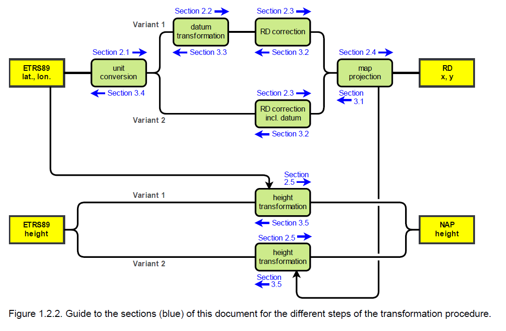
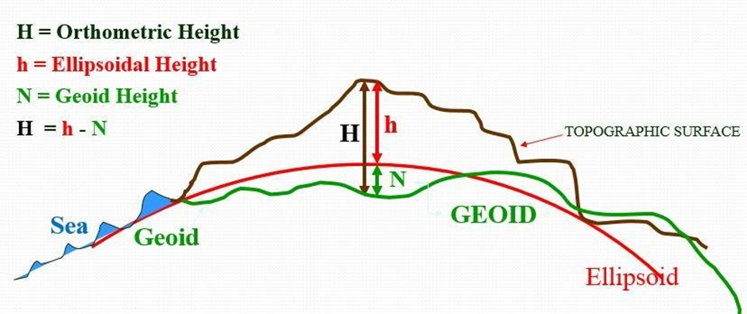

# RDNAPTRANS, CRS, and Map Projections

## RDNAPTRANS

For RDNAPTRANS the context of question set is actually not that important, so you'll see some questions without their introduction.

!!! question

    Explain the oblique stereographic double projection

=== "Answer"

    It is used to simplify the projection process and maintain conformality. 
    - Both steps in the double projection (ellipsoid → sphere and sphere → plane) are conformal projections, meaning they preserve local angles and shapes.
    - A single projection directly from the ellipsoid to a plane would be mathematically complex to ensure conformality, especially for an oblique stereographic projection like the RD system uses.

<!-- ## a2) Historical background of RD system (realization, triangulation) -->

!!! question

    Describe the historical realization of the RD system

=== "Answer"

    To ensure that all surveyors in the Netherlands can work in RD, the Department of National Triangulation of the Land Registry maintains reference points throughout the European Netherlands of which they have determined the RD coordinates. The location of approximately 5,500 of these so-called RD points has been accurately determined using triangulation. For the most part, these are the tops of church towers that are only suitable as a reference point. Since 1987, relative GPS measurements have also been used and some 400 so-called GPS core network points have been created that are suitable for setting up surveying GNSS equipment. The ETRS89 coordinates and the NAP height of these points have also been determined in relation to continuously active GNSS reference stations.

<!-- ## a3) False easting and false northing -->

!!! question

    Explain the false easting and false northing in the RD system

=== "Answer"

    False easting and false northing are used to avoid negative coordinates and confusion between x and y values (The origin of the old RD system is located in Amersfoort).
    - 155 km West (False Easting).
    - 463 km South (False Northing).
    - This ensures all coordinates are positive.

<!-- ## c1) Coordinate operations in RDNAPTRANS procedure -->

!!! question

    Describe the coordinate operations in the RDNAPTRANS procedure, distinguishing between datum transformations and coordinate conversions

=== "Answer"

    - Unit conversion: notation in degrees, minutes and seconds
    - Datum transformation:
        - From ellipsoidal Cartesian to geocentric Cartesian (coordinate conversion)
        - 3D similarity transformation (datum transformation)
        - From geocentric Cartesian to ellipsoidal Cartesian (coordinate conversion)
    - RD correction: 
        - error propagation of measurement noise of the original (1888–1928) measurements of RD, the pseudo-Bessel coordinates must be corrected up to 0.25 m to obtain real Bessel coordinates
    - Double map projection (coordinate conversion)
        - Ellipsoid to sphere
        - Sphere to plane
    - Height transformation (coordinate conversion)
        - Quasi-geoid model NLGEO2018 is used
        - Interpolation is needed

    { width="500" }

<!-- ## c2) Purpose of RD-correction grid -->

!!! question

    What is the purpose of the RD-correction grid in the RDNAPTRANS procedure?

=== "Answer"

    Due to the error propagation of measurement noise of the original (1888–1928) measurements of RD, the pseudo-Bessel coordinates must be corrected up to 0.25 m to obtain real Bessel coordinates using the correction grid.

<!-- ## c3) Improvement of NTv2 procedure -->

!!! question

    What are the improvements of applying the NTv2 procedure?

=== "Answer"

    - New Data Format: RDNAPTRANS™2018 uses a new data format for grid files, which alters the order of transformation steps. By including the datum transformation in the correction grid (variant 2), the transformation aligns with a de facto standard, making it easier to implement in various software packages.  
    - Improved Accuracy: Within the administrative borders of the Netherlands, the changes from the 2008 to 2018 version of RDNAPTRANS™ result in maximum horizontal coordinate differences of 0.010 m at sea level, and an additional 0.001 m per 50 m height difference. The updated quasi-geoid grid model improves height coordinate transformations up to 0.03 m within the administrative borders of the Netherlands and up to 0.05 m outside those borders.  
    - Smoothed Discontinuities: The new correction grid has a different sampling in ellipsoidal coordinates. This resampling has smoothed discontinuities in the correction grid, particularly outside the administrative borders of the Netherlands, to allow for bilinear interpolation.  
    - Software Compatibility: Implementation variant 2 for the horizontal component is supported by more software.  
    - Grid Structure: The NTv2 files can contain both a parent grid for a larger area and a subgrid for a smaller more detailed area. This allows for more precise transformations within the area of the subgrid while providing broader coverage with the parent grid.

<!-- ## d1) Advantage of new geoid definition -->

!!! question

    What is an advantage of the new definition of the geoid for the Netherlands?

=== "Answer"

    Improved Height Accuracy: The new geoid model (NLGEO2018) reduces errors in height transformations, making it more reliable for applications like:
    - Flood risk management.
    - Infrastructure planning.
    - Precision agriculture.

<!-- ## d2) Advantage of larger coverage for RDNAPTRANS procedure -->

!!! question

    What is an advantage of the larger coverage of the RDNAPTRANS procedure?

=== "Answer"

    - Marine Applications: Accurate coordinate transformations in offshore areas
    - Crucial for:
        - Oil and gas exploration
        - Marine navigation
        - Environmental monitoring
    - Facilitates cross-border projects with neighboring countries

<!-- ## RDNAPTRANS Correction Grid Details -->

!!! question

    What causes the correction grid in RDNAPTRANS, and what are the implications of not using it?

=== "Answer"

    Cause:  
    This correction grid models the errors that were made in the original triangulation measurements. These errors of up to 25 cm with respect to Amersfoort are the result of the lower accuracy of the measuring instruments at the time. By modeling the errors instead of correcting them, the RD coordinates remained the same, so that geographic files and maps did not have to be adjusted.

    Implications of Not Using Correction Grid:
    The correction grid is designed to correct for the historical errors in the original RD measurements (1888–1928), which can propagate if not addressed. Without the grid, the transformed coordinates will deviate from the true RD coordinates as much as 0.25m.

<!-- ## b3) Disadvantages of using Rijksdriehoeksstelsel as default reference system -->

!!! question

    What are the disadvantages of sticking to the Dutch Rijksdriehoeksstelsel as the default reference system?

=== "Answer"

    - International Incompatibility: RD is a national system and not directly compatible with international systems like ETRS89 or WGS 84. This hinders data sharing and integration across borders.
    - Grid Limitations: The correction grids used in RDNAPTRANS™ have bounds, with decreasing accuracy and undefined corrections outside of these bounds.

<!-- ## Transition from RD to ETRS89: Pros and Cons -->

In 2013 the Dutch Kadaster started a project to investigate the pros and cons (for and against) of the transition to ETRS89-based storage, transfer, and analyses of the Dutch key-registers, abandoning the RD(x,y) Rijksdriehoeksstelsel projection and coordinates.

!!! question

    What are the arguments for and against transitioning to ETRS89-based storage and analysis?

=== "Answer"

    Pros:
    - Integrity with the European system, ETRS89 is the official  reference system of the Netherlands 
    - The falsely conversion of RD/ETRS89 can be prevented (current RDNAPTRANS procedure not supported by most GIS packages, resulting in unnecessary errors and complications)
    - RD is not consistent outside the correction grid / outside the Netherlands, gradual fade-out improves this but still. 
    - The older Bessel ellipsoid, established through triangulation, defines different longitudes and latitudes than satellite-based datums. 

    Cons:
    - calculations (for example computing an area) are easier in the Cartesian system than in latitude longitude 
    - most of the current maps are in RD, many one time costs (conversion/ updating of RD is undesirable for map users) 
    - Netherlands doesn't fit in a single ETRS89 zone

<!-- ## Height Profile Accuracy Using RDNAPTRANS -->

The survey company ‘Geomaat’ claims they should use the so-called RDNAPTRANS procedure to obtain an accurate height profile for this ‘truly flat and straight road’. The RDNAPTRANS procedure (Figure 3) connects ETRS89 and the Dutch height system NAP (Normaal Amsterdams Peil / Amsterdam Ordnance Datum) through the so-called geoid.

!!! question

    Do you agree? Discuss by describing / depicting:  
    The possibility to obtain the required cm-accuracy of a height profile by GPS measurements.  
    The geoid in relation to levelled (orthometric) NAP-height and GPS (ellipsoidal) height.

=== "Answer"

    Agree.  
    With the help of technologies like RTK or PPP_RTK, it's highly possible that we get a cm-dm accuracy.  

    To transform between ellipsoidal ETRS89 heights and NAP heights, a quasi-geoid model, specifically NLGEO2018 is used.    
    - NAP is a physical height system, where heights are measured relative to the geoid.  
    - GPS/GNSS, on the other hand, provides ellipsoidal heights.  

    { width="500" }

## GPS and RDNAPTRANS
<!-- ## b1) GPS base network and systematic errors in RD system -->

!!! question

    How did the GPS base network help study systematic errors in the RD system?

=== "Answer"

    GPS base network provided highly accurate ETRS89 coordinates across the country. By comparing the RD coordinates of points with their ETRS89 coordinates (derived from GPS), systematic errors in the RD system could be identified, including:
    - Distortions caused by the original triangulation methods used to establish the RD system.
    - Local deviations due to historical measurement inaccuracies.

<!-- ## b2) Why RD system errors were not an issue before GPS -->

!!! question

    Why were systematic errors in the RD system not a problem before GPS?

=== "Answer"

    Local Use of the RD System:
    - The RD system was primarily used for local mapping and surveying within the Netherlands.
    - For local applications, the systematic errors were small enough to be negligible, and the system was sufficiently accurate.

    Limited Need for Global Compatibility:
    - Before the widespread use of GPS, there was no need to align the RD system with global or European reference systems like ETRS89.
    - The RD system worked well in isolation for national purposes.

    Manual Surveying Techniques:
    - Traditional surveying techniques (e.g., triangulation) were less precise than GPS, so the systematic errors were not easily detectable or significant enough to cause issues.

<!-- ## Reasons Against Replacing First Order Levelling with GPS/GNSS -->

!!! question

    One could argue that first order levelling campaigns to maintain the NAP (Normal Amsterdams Peil) are obsolete because GPS/GNSS could replace these kind of measurements. Give two reasons why this change in measuring method had not taken place.

=== "Answer"

    Two key reasons:  
    - Accuracy and Reliability: The documentation indicates that ellipsoidal heights in ETRS89, as obtained by GNSS, are less precise than NAP heights obtained by leveling to nearby NAP benchmarks. Although GNSS measurements can provide accurate horizontal positions, they do not directly measure physical heights relative to a defined datum like NAP. 
    - By Definition of NAP: The definition of NAP is maintained by published heights of height benchmarks. These benchmarks are established and maintained through precise leveling campaigns. NAP is not defined by GNSS measurements but by a network of physical benchmarks.

## Map Projection
<!-- ## Map Projection Classes and Properties -->

!!! question

    Map projections can be grouped in three classes (besides the miscellaneous projections) depending on the nature of the projection surface. Name these three main groups, and state (include figures) the main properties.

=== "Answer"

    1. Cylindrical Projections:
       - Rectangular maps
       - Meridians and parallels as straight lines
       - Conformal angle preservation
       - Poles at infinite area
       - Useful for navigation

    2. Conic Projections:
       - Parallels as arcs of concentric circles
       - Meridians converge to North or South
       - Best for mid-latitude areas
       - Semi-conservation of area and angles

    3. Planar/Azimuthal Projections:
       - Preserve directions from a central point
       - Best for polar regions
       - Stereographic projection used in Dutch RD system

Discuss why the conformal Mercator projection (See Figure 2) badly distort area, by addressing (you might want to include some other figures ..):

!!! question

    What is the purpose of the Mercator projection in navigation?

=== "Answer"

    - The projection preserves local angles, making it ideal for determining directions accurately.
    - A ship or aircraft can follow a constant compass direction to reach its destination.

<!-- ## Mercator Projection Distortion of Greenland and Africa -->

!!! question

    Why does Greenland appear as large as Africa on Mercator Projection Maps?

=== "Answer"

    - Mercator projection exaggerates areas away from the equator towards the poles
    - Stretches Earth's surface horizontally and vertically to maintain angle preservation
    - Greenland (high latitude) appears much larger due to stretching effect
    - Africa (near equator) represented more accurately

<!-- ## Mercator Projection Map Cutting -->

!!! question

    Why are Mercator projection maps typically cut between 85°S and 85°N?

=== "Answer"

    - Mercator projection becomes mathematically infinite at the poles (90°)
    - Cutting off at 85°N and 85°S avoids:
        - Infinite map scaling
        - Extreme distortion
    - Ensures map remains usable
